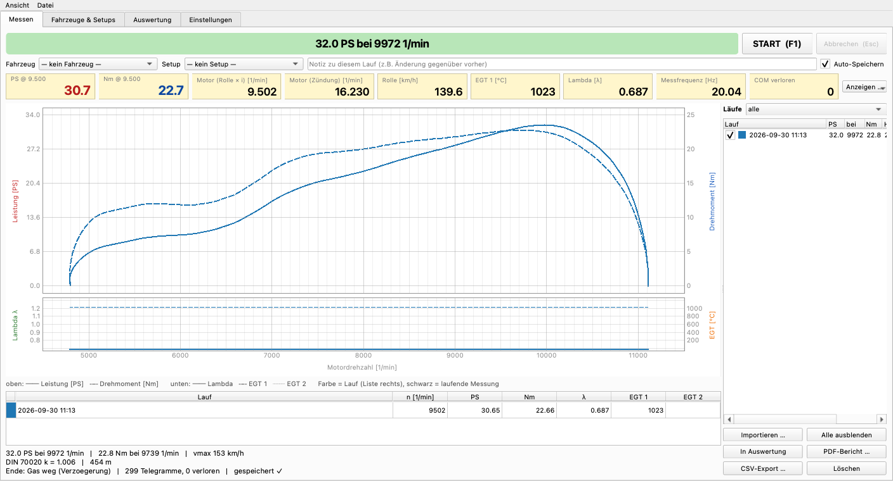

# WildBugChilGru PST – SimpleDyno & STM32-Messelektronik

Open-Source-Leistungsprüfstand (Rollenprüfstand) – Weiterentwicklung von
[WildBugChilGru](https://github.com/gruaGit/WildBugChilGru) (Arduino Mega + LabVIEW):

- **SimpleDyno** – neue PC-Software in Python/Qt für **Mac, Linux (Raspberry Pi) und Windows**.
  Rechnet wie LabVIEW 3.2.1 (an echten Läufen geprüft: gleiche Pmax und n(Pmax)), mit Datenbank für
  Fahrzeuge/Setups/Läufe, Auswerter im Stil von MegaLogViewer, PDF/CSV-Export, Import von LabVIEW-Läufen.
- **PST-STM32-Firmware** – neue Firmware für die Messelektronik auf **STM32F446RE (Nucleo-64)**.
  Spricht das Protokoll des Arduino-Mega-Sketches → läuft mit **LabVIEW 3.2.1**, mit der
  **STM-LabVIEW 0.2.0** (automatisch erkannt) und mit **SimpleDyno**.
- **Arduino-Mega-Sketch 3.0.0** – der bisherige Mega-Aufbau läuft ebenfalls mit SimpleDyno.



## Was läuft womit

| Messelektronik | LabVIEW 3.2.1 | STM-LabVIEW 0.2.0 | SimpleDyno |
|---|---|---|---|
| STM32 + PST-STM32-Firmware 1.0 | ✅ am Prüfstand | ✅ Protokoll geprüft¹ | ✅ am Prüfstand |
| Arduino Mega + Sketch 3.0.0 | ✅ (Original) | Arduino-Modus² | ✅ im Simulator geprüft³ |

¹ 8-Byte-Befehle und 20-Byte-Binärtelegramm per Host-Test gegen die aus LabVIEW rekonstruierte Auswertung.
² Umschalter „Arduino<>STM“ der STM-LabVIEW, nicht getestet.
³ `SIM:mega` bildet den Sketch nach (Umschalten mit `m`, ganze Hz, 61 Hz); am echten Mega noch zu bestätigen.

## Schnellstart

→ Ausführlich: **[INSTALL.md](INSTALL.md)**

```bash
# SimpleDyno (Mac/Linux) – richtet sich beim ersten Start selbst ein
cd SimpleDyno
./start_mac.command          # Mac   (Linux: ./start_linux.sh, Windows: start_windows.bat)
./start_mac.command --sim    # ohne Hardware: Simulator spielt einen echten Lauf ab
```

STM32 flashen: `firmware/stm32/bin/PST-STM32_v1.0.0.bin` auf das Laufwerk **NODE_F446RE** ziehen.

## Inhalt

```
SimpleDyno/            PC-Software (Python 3.9+, PySide6, pyqtgraph)
firmware/stm32/        Firmware STM32F446RE (PlatformIO), fertige .bin in firmware/stm32/bin/
firmware/arduino-mega/ Arduino-Mega-Sketch 3.0.0 + Bibliotheken
docs/                  Roadmap, Protokoll v2, Hardware v3, WSB/CAN-Vorbereitung, Zahnriementrieb W130
```

## Dokumentation

- [INSTALL.md](INSTALL.md) – Installation Mac / Linux / Windows, Flashen STM32 und Mega
- [SimpleDyno/README.md](SimpleDyno/README.md) – Bedienung, Rechenweg, Kommandozeile
- [firmware/stm32/README.md](firmware/stm32/README.md) – Firmware, Protokoll, Anschlussbelegung, Einstellungen
- [SimpleDyno/TESTPLAN.md](SimpleDyno/TESTPLAN.md) – Vergleichstest alt/neu
- [docs/ROADMAP.md](docs/ROADMAP.md) – Weiterentwicklung (Protokoll v2, Platine v3, rusEFI, Wirbelstrombremse)

## Wichtige Hinweise

- **Filter zählen Messpunkte:** Mega ≈ 61 Hz, STM32 60 Hz, alte STM-Firmware 20 Hz. MA/dq für 20 Hz
  (z.B. 35/15) entsprechen bei 60 Hz etwa 105/45. SimpleDyno zeigt die Filterzeit in Sekunden an.
- **„n vom Gas“** ist die Schwelle, ab der ein Laufende (fallende Drehzahl) erkannt wird – sie muss über
  der Haltedrehzahl liegen.
- SimpleDyno steuert den Motor nicht. „n Stop“ beendet nur die Aufzeichnung und zeigt **GAS WEG**.

## Lizenz

GNU General Public License v3 – siehe [LICENSE](LICENSE).
