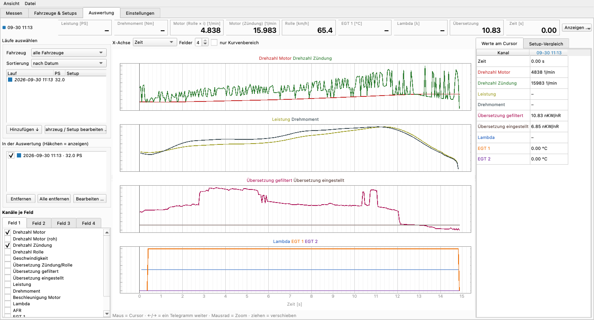

# SimpleDyno

Einfaches Prüfstandsprogramm zum Testen der neuen PST-STM32-Firmware – ohne Windows und ohne LabVIEW.
Läuft auf **Mac**, **Linux/Raspberry Pi** (und Windows).

- steuert die Messelektronik: Klima lesen (`e`), Messung starten (`m`) und stoppen (`s`)
- Lauf mit **fester Übersetzung**, Start bei *n vom Gas*, Ende bei **n Stop** (z.B. 8000 1/min) oder beim Gaswegnehmen
- Prüfstandsdaten: Rollengeber, Rollenumfang, Trägheit, Zündimpulse, Filter, Verlustmoment
- Übersetzung optional aus dem Zündsignal messen (5 s, getrimmter Mittelwert wie LabVIEW)
- Live-Anzeige (Motor berechnet und gemessen, km/h, Messfrequenz, verlorene Telegramme), Live-Kurve
- **Rechnet exakt wie LabVIEW 3.2.1.** Geprüft an sechs echten Läufen vom 26.05.26: gleiche Pmax auf 0,1 PS, gleiche n(Pmax).
- Speichert jeden Lauf als CSV, JSON, PNG und **LabVIEW-XML** (öffnet in LabVIEW-Recalc)
- lädt LabVIEW-Läufe und SimpleDyno-Läufe zum Vergleich (Überlagerung und Tabelle)
- eingebauter **Simulator**, um ohne Prüfstand zu testen

Testablauf für den Vergleich alt/neu: siehe [TESTPLAN.md](TESTPLAN.md).



## Oberfläche

| Reiter | Inhalt |
|---|---|
| **Messen** | Status (GO / Messung / GAS WEG), Live-Werte (Motor, Zündung, km/h, EGT 1/2, λ, TPS, Messfrequenz, COM), Leistungsdiagramm (PS/Nm oben, λ/EGT unten), Laufliste mit Häkchen zum Ein-/Ausblenden, Cursor-Tabelle (Werte aller sichtbaren Läufe bei der Drehzahl unter der Maus) |
| **Fahrzeuge & Setups** | Datenbank: Hersteller, Modell, Vergaser/EFI; je Setup Motor (Hubraum, CR, Steuerzeiten), Vergaser (Düsen, Nadel, Clip …), ECU/Tune, Zündung, Antrieb (Übersetzung, Vario, Rollen, Federn), Ein-/Auslass, Kraftstoff. Setups kopieren, „für neue Läufe verwenden“. |
| **Auswertung** | Fahrzeug wählen → Läufe nach Datum oder nach Setup gruppiert → **Hinzufügen**, dann nächstes Fahrzeug. Fahrzeug/Setup direkt bearbeiten (auch Rechtsklick: Setup zuordnen, neues Setup). Log-Viewer wie MegaLogViewer: bis 4 Felder, beliebige Kanäle (gleiche Einheit = gleiche Skala), Cursor mit Maus und ←/→, X-Achse Zeit oder Drehzahl, beliebig viele Läufe (Farbe je Lauf, Linienart je Kanal). **Setup-Vergleich** mit markierten Unterschieden. Kanal „Übersetzung Zündung/Rolle“. |
| **Einstellungen** | Verbindung, Prüfstand, Lauf, Filter & Verluste, Klima, Anzeige (λ oder AFR) |

- Während eines Laufs bleibt die Skalierung wie beim vorherigen Lauf stehen; danach wird neu skaliert.
- Nm-Achse mit runder Teilung, die PS-Achse wird so gelegt, dass ihre Striche auf denselben Gitterlinien liegen.
- Läufe bleiben in der Datenbank (`~/SimpleDyno/simpledyno.db`, Messdaten in `~/SimpleDyno/messungen/`).
  Rechtsklick auf einen Lauf: Notiz, Farbe, Fahrzeug/Setup zuordnen, mit aktuellen Einstellungen neu rechnen, CSV, löschen.
- **Import** von LabVIEW-XML und SimpleDyno-Läufen, **Export** als PDF-Bericht (sichtbare Läufe + Setup-Daten) und CSV (Excel deutsch oder international).
- Neue Messkanäle (z.B. rusEFI: TPS, λ, MAP, Zündwinkel; später WSB) sind zusätzliche Spalten in `roh.csv` und
  erscheinen automatisch im Auswerter und im CSV-Export.

## Start

**Mac:** Doppelklick auf `start_mac.command` (beim ersten Mal wird alles eingerichtet), oder im Terminal:

```bash
cd PST-SimpleDyno
./start_mac.command            # mit Prüfstand
./start_mac.command --sim      # Simulator: spielt den echten Lauf 161802 (26.05.26) ab
./start_mac.command --sim --synth   # Simulator mit synthetischem Motor
```

Der Nucleo erscheint als `/dev/cu.usbmodem…` in der Port-Liste.

**Windows:** `start_windows.bat` doppelklicken (Python 3 von python.org, „Add to PATH“).

**Messelektronik:** PST-STM32-Firmware (Nucleo-F446RE) oder Arduino-Mega-Sketch 3.0.0 – wird beim
Verbinden erkannt. Installation und Flashen: [../INSTALL.md](../INSTALL.md).

**Raspberry Pi (Raspberry Pi OS 64 bit, Desktop):**

```bash
sudo apt install python3-venv libxcb-cursor0
sudo usermod -aG dialout $USER     # einmalig, danach ab- und wieder anmelden
./start_linux.sh
```

Der Nucleo erscheint als `/dev/ttyACM0`.

## Kommandozeile (ohne Oberfläche)

```bash
./.venv/bin/python -m simpledyno ports                              # Ports anzeigen
./.venv/bin/python -m simpledyno run --port SIM --n-stop 8000       # Lauf im Terminal
./.venv/bin/python -m simpledyno recalc ../*.xml                    # LabVIEW-Läufe nachrechnen
./.venv/bin/python -m simpledyno compare A.xml B.xml ~/SimpleDyno/messungen/*/lauf.json
```

Alle Prüfstandsparameter lassen sich überschreiben, z.B. `--ratio 6.85 --inertia 13.5 --n-min 4000`.

## Bedienung

1. Port wählen → **Verbinden**. Die Firmware-Version erscheint unter dem Knopf.
2. Prüfstand- und Laufdaten prüfen. Sie werden in `~/SimpleDyno/einstellungen.json` gespeichert.
3. Drehzahl unter *n vom Gas* halten → **START (F1)** → Klima wird gelesen → **GO – Vollgas!**
4. Über *n vom Gas* beginnt die Messung (gelb), ab *n Stop* erscheint **GAS WEG!** (rot).
5. Ergebnis wird angezeigt und (Auto-Speichern) unter `~/SimpleDyno/messungen/` abgelegt.
6. **Abbrechen (Esc)** jederzeit.

*n vom Gas* muss über der Haltedrehzahl liegen. Sonst erkennt die Auswertung (wie LabVIEW) schon
beim Halten ein „Laufende“, weil die Drehzahl dort schwankt.

## Rechenweg (aus LabVIEW 3.2.1 übernommen)

- nRolle = 60 · f_Rolle / Inkr, dT = 1 / Messfrequenz
- Rolle geglättet: Dreieck-Mittelwert, Halbbreite ⌊MA/2⌋; dT: Rechteck, Halbbreite dq
- n = nRolle · i, ω = n · 2π/60, a = zentraler Differenzenquotient über ±dq Punkte
- M = k · J / i² · a + Mv / i, P = ω · M, PS = 0,00135962 · P
- k (DIN 70020) = 1013 / p · √((T + 273,15) / 293,15)
- *n vom Gas* ist nur die Schwelle für die Ende-Erkennung: Der Lauf endet bei der ersten fallenden Drehzahl
  oberhalb von *n vom Gas* (oder bei *n Stop*). Unter der Schwelle wird nichts abgeschnitten. Entfernt wird nur
  der Vorlauf bis zur letzten fallenden Drehzahl unterhalb der Schwelle (das Halten vor dem Gasgeben).

Details und Quellenhinweise stehen in `simpledyno/physics.py`.

## Tests

```bash
./.venv/bin/python -m unittest discover -s tests -v
```

## Aufbau

```
simpledyno/physics.py   Auswertung (LabVIEW-identisch)
simpledyno/link.py      serielle Verbindung (STM32-Firmware, Arduino-Mega-Sketch)
simpledyno/runner.py    Ablauf eines Laufs
simpledyno/storage.py   Speichern/Laden (CSV, JSON, LabVIEW-XML)
simpledyno/lvxml.py     LabVIEW-Datenspeicher lesen/schreiben
simpledyno/sim.py       Simulator (Firmware + Motor + Rolle)
simpledyno/gui.py       Oberfläche (PySide6 + pyqtgraph)
simpledyno/plots.py     Leistungsdiagramm mit ausgerichteten Achsen und Cursor
simpledyno/viewer.py    Auswerter (MegaLogViewer-Stil)
simpledyno/db.py        Datenbank Fahrzeuge / Setups / Läufe (SQLite)
simpledyno/channels.py  Messkanäle eines Laufs (roh + abgeleitet + Zusatzkanäle)
simpledyno/report.py    PDF- und CSV-Export
simpledyno/widgets.py   Anzeigen (live und am Cursor)
simpledyno/dialogs.py   Eingabemasken Fahrzeug/Setup, Bearbeiten-Dialog
```
